# Architecture diagrams

Mermaid source. Renders natively on GitHub and in VS Code with the Markdown
Preview Mermaid extension.

Pre-rendered PNGs of every diagram are in `docs/diagrams/` if you want to
drop one into a slide or a README without a renderer.

To re-render after editing:

```bash
npm install -g @mermaid-js/mermaid-cli
mmdc -i docs/DIAGRAMS.md -o docs/diagrams/out.md   # or per-diagram, see below
```

---

## 1 · Layering

Dependencies point one way only. The arrow direction is the whole rule: if
you ever find `app/domain` importing from `app/api`, something has gone
wrong.

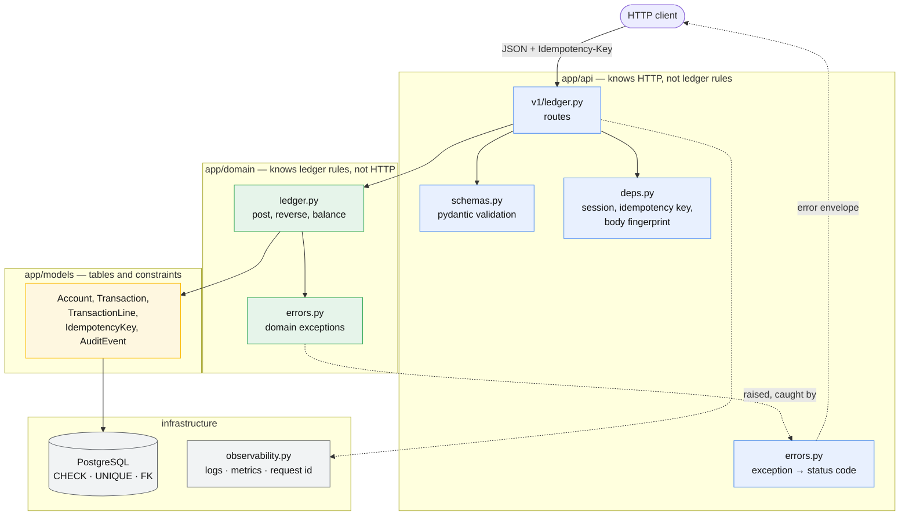

---

## 2 · Data model

Note what is absent: no `balance` column, no `status` column, no
`updated_at` anywhere. Those absences are the design.

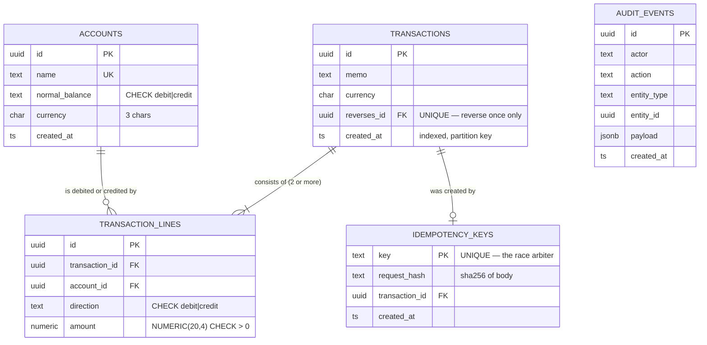

### Why amounts are positive with a separate direction

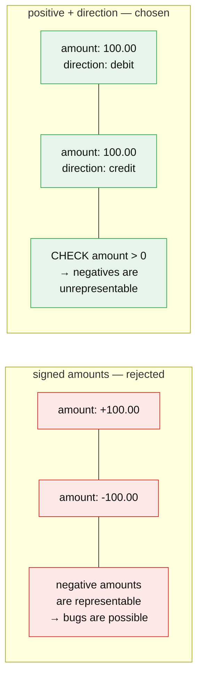

---

## 3 · A posting, end to end

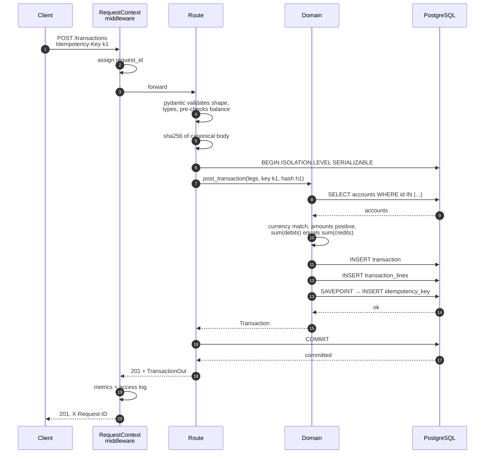

---

## 4 · The race that matters

Two identical requests with the same idempotency key, arriving at the same
instant. This is the diagram to be able to draw on a whiteboard.

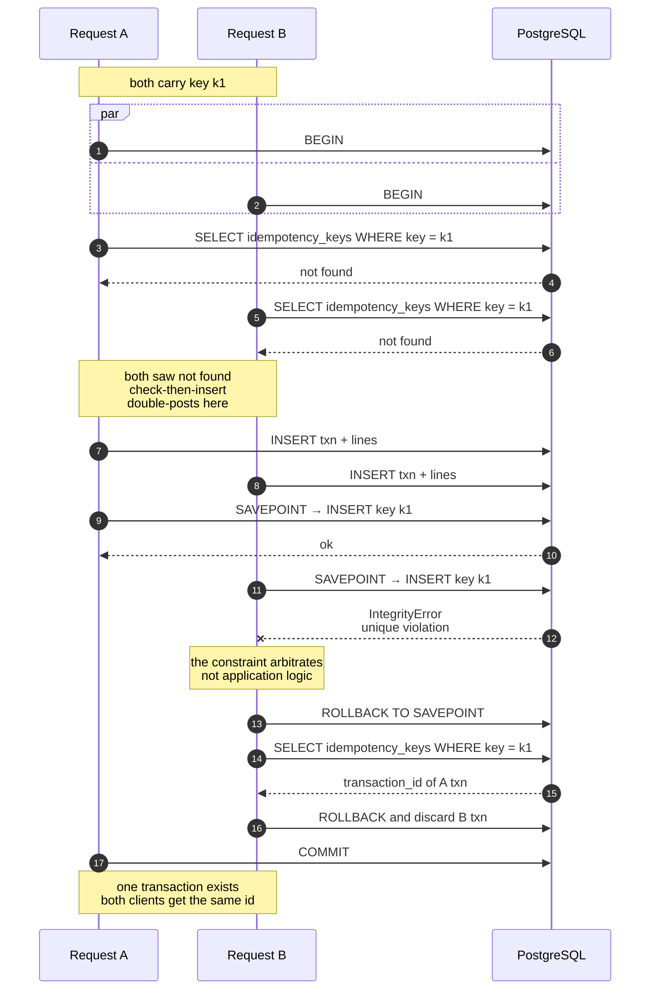

---

## 5 · Isolation and retry

Why writes run at SERIALIZABLE, and what happens when Postgres aborts them.

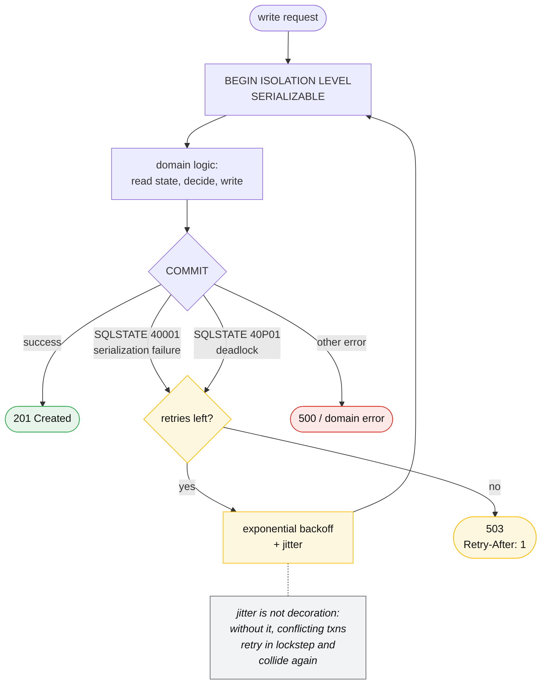

### The write skew this prevents

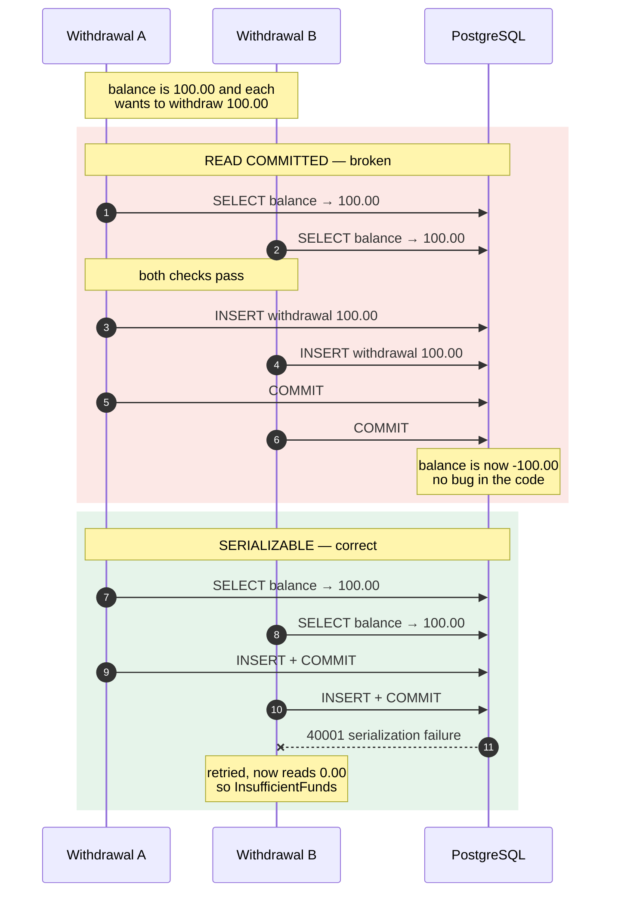

---

## 6 · Corrections are appends

There is no edit path and no delete path. A correction is a new fact.

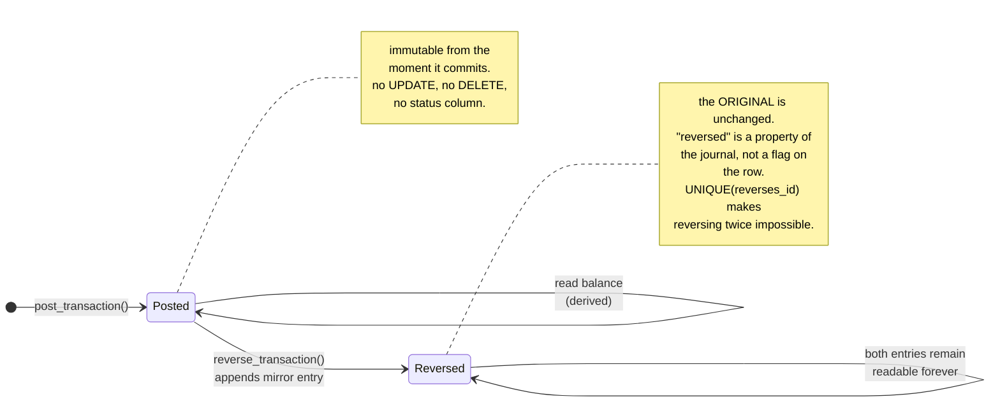

---

## 7 · Where balances come from

```mermaid
flowchart LR
    subgraph J["the journal — source of truth"]
        L1["debit  cash    100.00"]
        L2["credit wallet   97.50"]
        L3["credit fees      2.50"]
        L4["credit wallet    5.00"]
        L5["debit  wallet   10.00"]
    end

    J --> Agg["SUM by direction<br/>WHERE account_id = ?<br/>AND created_at <= as_of"]
    Agg --> Sign{"account.normal_balance"}
    Sign -->|credit| CB["credits − debits"]
    Sign -->|debit| DB2["debits − credits"]
    CB --> Out(["balance"])
    DB2 --> Out

    Out -.->|"as history grows,<br/>this scan gets slow"| Snap

    subgraph S["milestone 7 — snapshots"]
        Snap["balance_snapshots<br/>(account, seq, amount)"]
        Delta["+ SUM(lines since seq)"]
        Snap --> Delta --> Fast(["balance, O(recent)"])
    end

    classDef truth fill:#e6f4ea,stroke:#34a853,color:#111
    classDef later fill:#f1f3f4,stroke:#5f6368,stroke-dasharray: 4 4,color:#111
    class L1,L2,L3,L4,L5 truth
    class Snap,Delta,Fast later
```

---

## 8 · Scaling path

Each stage is enabled by the append-only decision. None of them are
retrofits, except partitioning — which is why it has to be decided early.

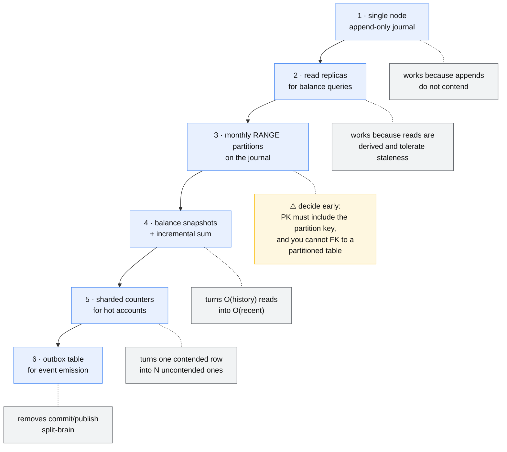

---

## 9 · Request lifecycle, including failures

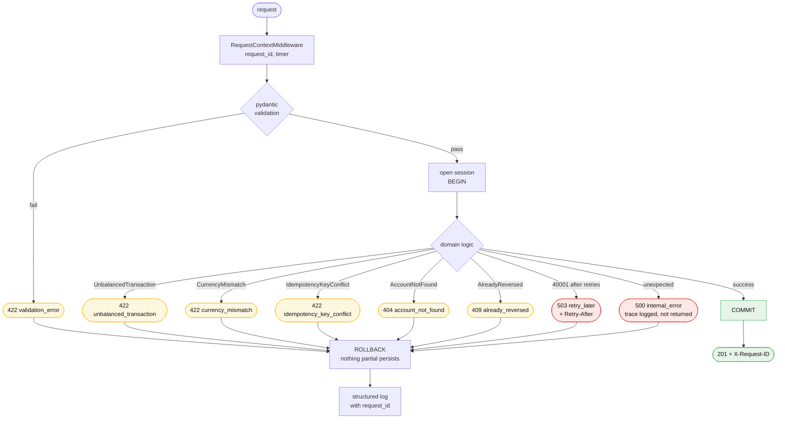
